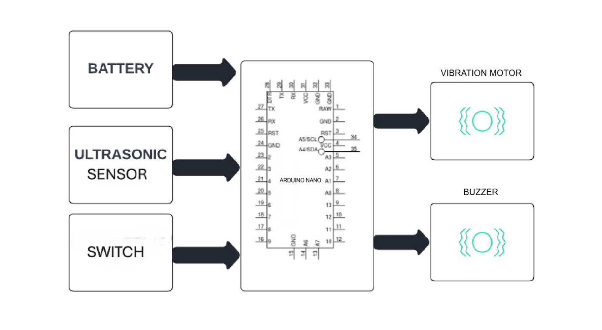
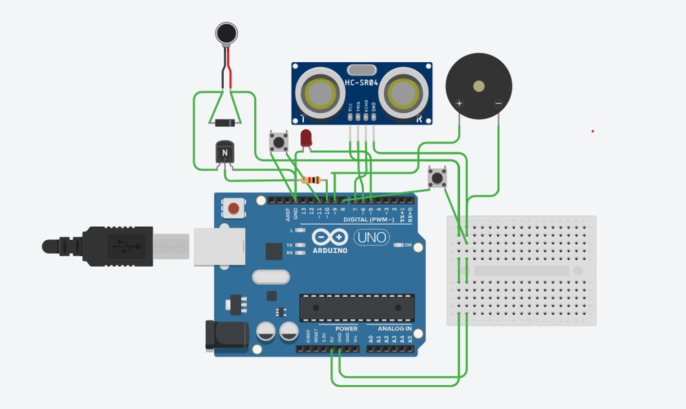

# Obstacle-detecting-glasses
Smart glasses for visually impaired people using ultrasonic sensor, Arduino, buzzer, and vibration motor.

# Obstacle-Detecting Smart Glasses for Visually Impaired

## 🔹 Overview
Traditional canes help visually impaired people detect **ground-level obstacles**, but they fail to detect **face-level hazards** like low branches or hanging boards.  
These **Obstacle-Detecting Smart Glasses** provide a **hands-free solution** by using an **ultrasonic sensor** to detect nearby obstacles at face height.  

When an object is detected within a set range, the system provides alerts through a **vibration motor, buzzer, or both**, depending on the selected mode.  
The user can switch between **three distance modes** and **three alert modes** using just **two push buttons**.  

The system is **compact, affordable, and wearable**, making it a practical choice for everyday use and easy to upgrade in the future.  

---

## 🔹 Problem Statement
Visually impaired people often face difficulties navigating safely due to unseen obstacles in their path, especially those at face level.  
While tools like **white canes** and **guide dogs** offer some support, they are limited in detecting obstacles early and providing **real-time alerts**.  
This lack of timely feedback can lead to accidents and reduce user confidence in unfamiliar environments.  

---

## 🔹 Objective
To develop **smart glasses** that detect face-level obstacles using **ultrasonic sensors** and provide **real-time alerts** through vibration and sound, thereby improving safety, confidence, and independence.  

---

## 🔹 Features
- Detects **face-level obstacles** that traditional canes miss  
- **Hands-free wearable design** for comfort and freedom  
- **Three distance modes** (short, medium, long)  
- **Three alert types** (vibration, buzzer, both) → total of **six operating modes**  
- Easy switching between modes using just **two push buttons**  
- **Compact, lightweight, and low-cost**  
- Built with **commonly available components** → easy to maintain & upgrade  

---

## 🔹 System Design & Architecture
The system continuously measures the distance to nearby obstacles using an **ultrasonic sensor**.  
If an obstacle is detected within the selected threshold:  
- The **Arduino** activates the alert system  
- Based on the mode selected, the system triggers:  
  - Vibration motor (silent haptic feedback)  
  - Buzzer (audible alert)  
  - Or both together  

### Distance Modes
- **Short Range** → very close obstacles  
- **Medium Range** → for indoor use  
- **Long Range** → for outdoor areas  

### Alert Modes
- **Vibration Only** → silent, discreet feedback  
- **Buzzer Only** → audible alert  
- **Vibration + Buzzer** → maximum awareness  

---

## 🔹 Components Used
- **Ultrasonic Sensor (HC-SR04)** → Measures obstacle distance  
- **Arduino Uno / Nano** → Main controller  
- **Vibration Motor** → Provides haptic feedback  
- **Buzzer** → Provides sound alerts  
- **LED** → Visual indication  
- **Push Buttons (x2)** → Mode selection  
- **Sliding Switch** → Power control  
- **Rechargeable Battery Pack** → Portable power source  
- **Glasses Frame** → Mounting platform for components  

---

## 🔹 Circuit Diagram & System Architecture
(Add your diagrams here once uploaded)  

```markdown


